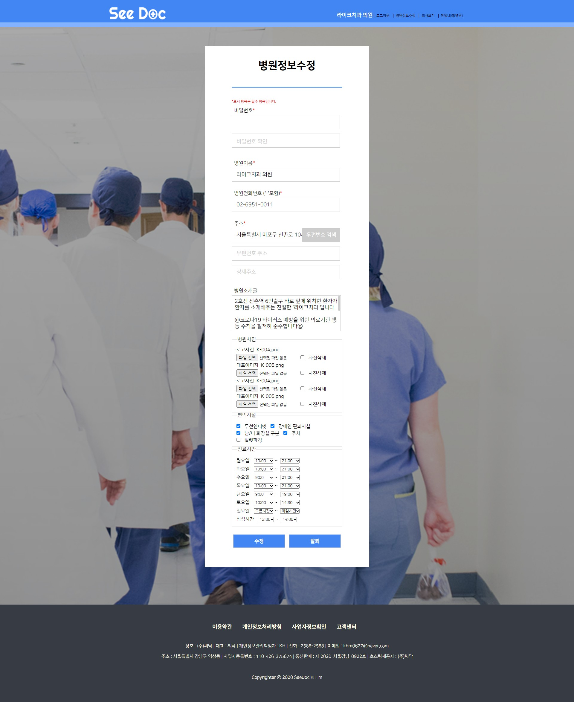

# SeeDoc
> 병원예약 및 병원 개인 페이지 제작 서비스

## 개발 목표
- 2020년 06월 22일 ~ 2020년 07월 21일  종료
1. 병원 사전 예약으로 대기 시간 감소
2. 환자에게 맞는 병원 / 의사 찾기
3. 병원 이용자만 작성 할 수 있는 믿을 만한 리뷰
4. 캘린더를 통한 예약 System 구축
5. 지도api를 통한 병원 찾기 구현
6. 병원에서 직접 관리하는 건강상식 게시판
   
## 개발 환경
1. Server  

2. Language  

  

3. Tool  

  

## 화면 및 기능
1. 메인화면
  

2. 메인화면 - 검색
 - 병원, 의사, 진료과 명으로 검색

3. 메인화면 - 지도 검색
 - 해당 지역을 클릭으로 통해 검색

4. 메인화면 - 진료과 검색

5. 메인화면 - 예약내역

6. 메인화면 - 일반 유저 - 예약내역 상세

7. 병원 클릭 - 병원 개인 홈페이지
 - 병원 정보 수정에서 슬라이드 이미지, 로고 등 병원에 맞게 커스텀 가능

8. 병원 예약
 - 예약되지 않은 일시로 예약

9. 메인화면 - 병원 유저 - 예약내역 상세

10. 병원 정보 수정

11. 병원 의사 수정 추가 삭제

12. 유저 정보 수정

13. 관리자 페이지

14.  로그인

15. 404 Page

